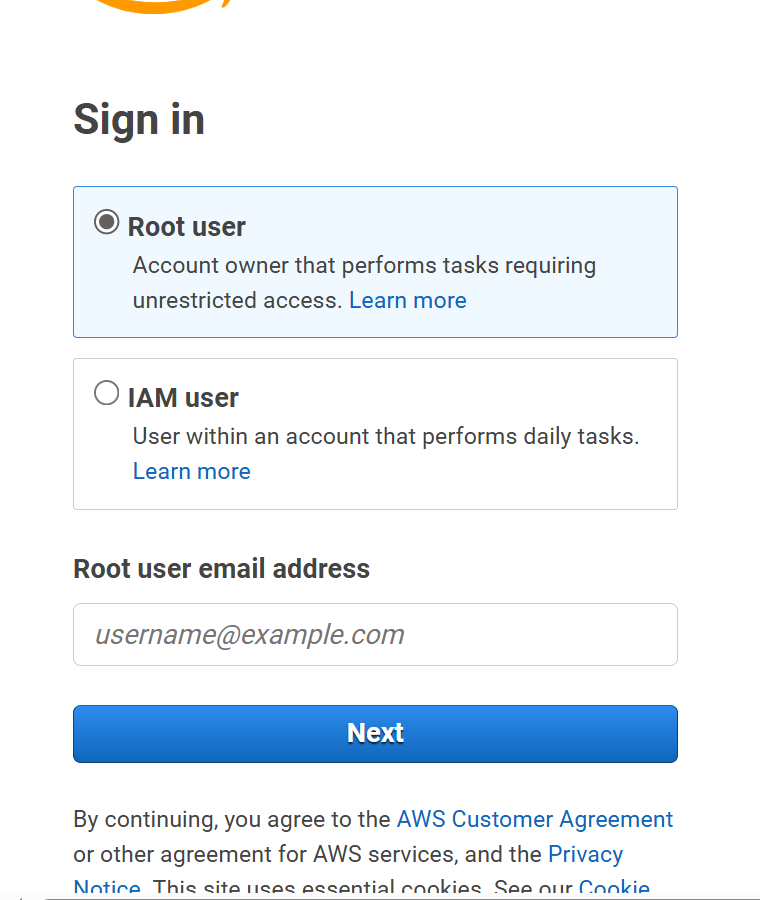
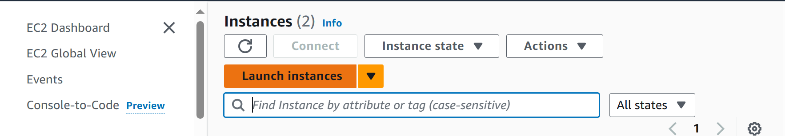
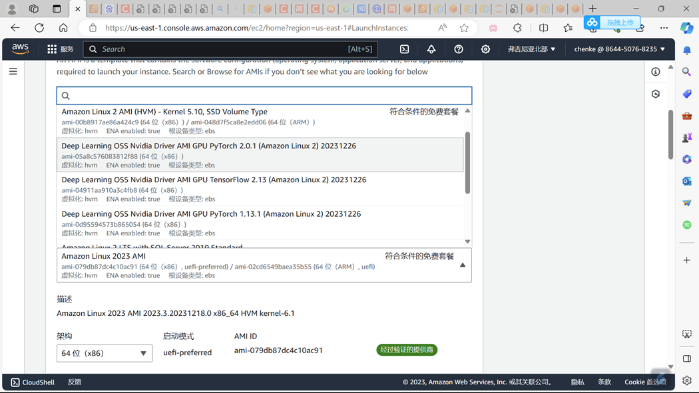
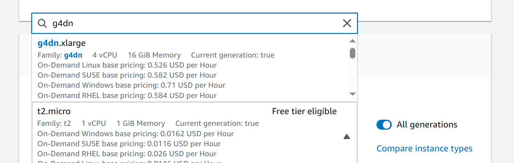
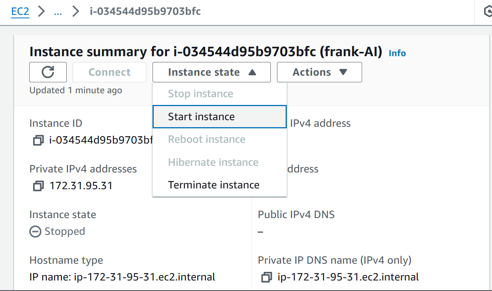

#        AI-driven-dynamic-smile-analysis-for-orthodontics

Dynasmile is a Python-based AI-driven dynamic smile analysis tool for dental  research. It uses computer vision techniques to analyze smile process, extracting the "peak frame" from the whole video, automatically generating measurements from auto-detected facial landmarks. The application tracks facial expression change and detects multiple facial landmark points, generating statistical and graphical record for smiling expression. These outputs aid in the analysis of facial analysis regarding smiles, which is helpful for diagnosis of dentofacial abnormalities and issues. Dynasmile offers smile video processing, unit standalization, and organized data output for effective data storage and display.


## Installation
The following step-by-step procedure will guide you through installation of the software. Since this software follows a server-client infrastructure to reduce the heavy calculation cost of AI with local computer, there's a AI calculation module(server) that requires the user to install on remote server, so the installation process will be divided into two parts:
the server part and the client part.

### The server part

! The following code is only tested on Amazon EC2, and other servers are not tested.If you find any ways to set up on other servers, please E-mail: dentistfrankchen@outlook.com

!! The following text will guide you on building your own EC2 server.

1. register your own Amazon account. After registration, please sign in here.


2. After you get to the EC2 page, click "launch instance".

3. Choose the platform as follows:

4. Choose G4dn.xlarge as the core.(You can choose any other core with gpu.)

5. Set up the storage and lauch the instance.（IF you are new to EC2, there might be limit with vCPU.If you want to try using the server I configured please contact me via E-mail:dentistfrankchen@outlook.com.

6. Start the instance. 

7. Connect the instance via any ssh client.
Then you are ready to go!
I highly recommend you install a **jupyterlab** at the same time, so you can handle anything with the server through a gui-like window.
(**If you have any problem with any of the above steps, please let me know and I will help you dentistfrankchen@outlook.com**)

8. Upload ./server/requirements.txt to your server and install it through pip.

9. Copy ./server/service.zip to your server and unzip it.

10. Open the terminal and run 
```bash
sh 1.sh
```
to test whether it is properly installed.

### The client part
Extract the client folder from the Dynasmile main folder.

Python version : 3.8.1
Pip version : 24.1.2
1. Create a python virtual environment using the following and put it to the location like this:
```bash
├─Parent
   └─client
```
In order to create the venv folder,just 
```bash
python -m venv your/path/to/Dynasmile/venv
```
Now you will get:
```bash
├─Parent
   └─venv
    │  └─Scripts
    │    └─python.exe
   └─client
```

2. Copy the requirements.txt in the client folder and install by:
```bash
 cd  your/path/to/client
 your/path/to/venv/Scripts/pip.exe install -r requirements.txt 
```

## How to run the program
### Start the server
1. First you need to connect to the EC2 server through SSH. Open your SSH client and type in the following command:
```bash
ssh -i "your-key-name.pem" ec2-user@ec2-your-ec2-ip-address.compute-1.amazonaws.com
```
The following gif presents this process(given that your-key-name is frank-key,and your-ec2-ip-address is 3.86.200.102):


2. Just as previously mentioned, after you are connected to the EC2 server, you can simply type in
```bash
sh 1.sh 
```
to start.


3. Connect to the 5000 port.Type the following command in your SSH client software(given that your-key-name is frank-key,and your-ec2-ip-address is 3.86.200.102):
```bash
ssh -N -L 5000:localhost:5000 -i "frank-key.pem" ec2-user@ec2-your-ec2-ip-address.compute-1.amazonaws.com
```


### run the local program
Assume you already have the folder structure like:
```bash
├─Parent
   └─venv
    │  └─Scripts
    │    └─python.exe
   └─client
```
Please go to client>cat-process(sim)>main.bat to start running this program.

**Note that you should consider modifying **
